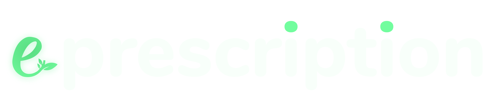
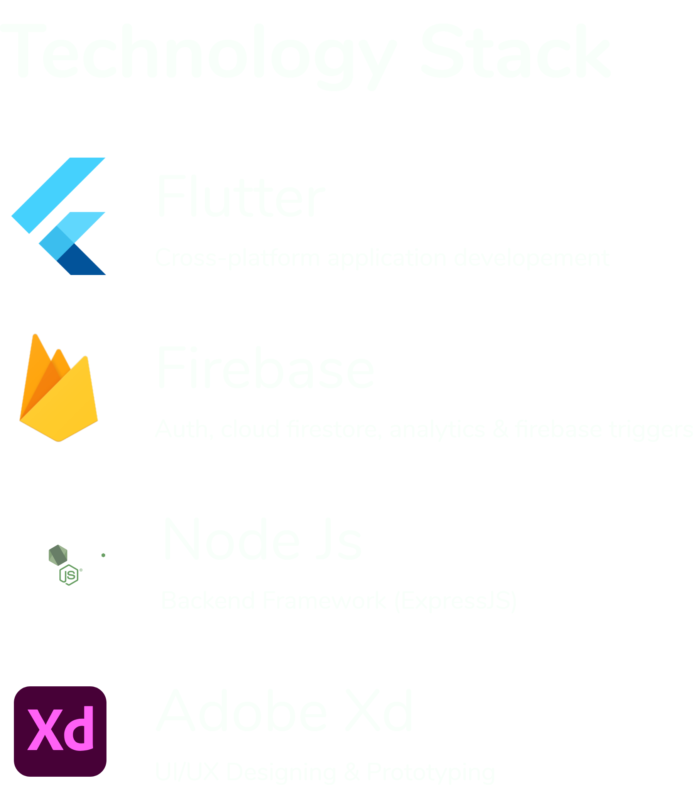

<!-- <center><h1> eRx : E-Prescription </h1></center> -->
<!--  -->


## Google Solution Challenge :
This project is a part of the solution for the problem statement for [Google Solution Challenge 2022](https://developers.google.com/community/gdsc-solution-challenge). 
The mission of the 2022 Solution Challenge is to solve for one or more of the United Nations 17 Sustainable Development Goals using Google technology.
In this project, we are trying to solve the following UN Goals:


## Prerequisites:
- Setup [Flutter](https://docs.flutter.dev/get-started/install) environment
- Setup [Firebase](https://firebase.flutter.dev/docs/overview/) App & download `google-services.json` file to `android/app`


## Run on Local Machine
1. Clone the repository & Change directory
```sh
git clone https://github.com/HeveshL/warehouse_management.git
cd warehouse_management
```
2. Flutter pub get & run
```sh
flutter pub get
flutter run
```

## Project Details:
#### "eRx" aims to provide a technological solution that aims to solve the fundamental problems mentioned above by standardizing the transaction of prescriptions between different entities. 
* The standardization and digitalization of the prescription offer several benefits to the involved parties. As all the prescriptions are digitized, the patient does not need to maintain a record of their previous prescriptions as it is readily available in the system. This also ensures that the doctor can look at the previous prescriptions to give an informed diagnosis. 
* A standard format makes sure that there is no chance of misunderstanding or misinterpretation. All the prescriptions, regardless of the hospital or the doctor will have a fixed format that will have all the necessary information. Thus, all the parties know what to expect from the prescriptions. 
* The Paperless and Contactless transaction model will ensure that there is no need for paper, thus making the entire system more sustainable. Also, the handling of the prescriptions will be entirely digital and contactless, making it very convenient to use and share with the pharmacist. 

> Our main goal is to create a unified platform/interface for standardizing the prescriptions in India.


## Technology Stack 💻

1. Flutter : Cross-platform application developement <i class="fas fa-band-aid"></i>

2. Firebase : Auth, cloud firestore, analytics & firebase triggers

3. Node Js : Backend Framework (ExpressJS)

4. Adobe Xd : UI/UX Designing & Prototyping

## License

[MIT](https://choosealicense.com/licenses/mit/)

## Authors

- Hevesh Lakhwani [@heveshL](https://github.com/HeveshL)
- Shubham Joshi [@Shubhamjoshi301](https://github.com/Shubhamjoshi301)
- Henay Lakhwani [@henaylakhwani](https://github.com/henaylakhwani)
- Yash Thakre [@thakreyn](https://github.com/thakreyn)

<!-- <center></center> -->
